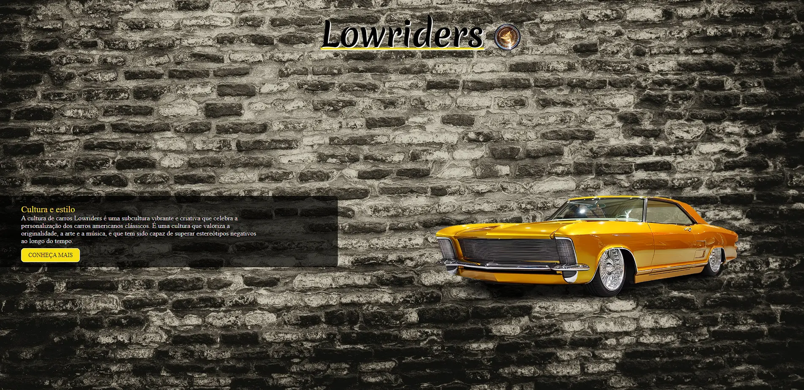

<h1 align="center"> Lowriders </h1>

  <a href="#-tecnologias">Tecnologias</a>&nbsp;&nbsp;&nbsp;|&nbsp;&nbsp;&nbsp;
  <a href="#-projeto">Projeto</a>&nbsp;&nbsp;&nbsp;

 

  

## 🚀 Tecnologias

Esse projeto foi desenvolvido com as seguintes tecnologias:

- HTML e CSS
- Git e Github

## 💻 Projeto

Lowriders website é um projeto pessoal para colocar em prática conteúdo aprendido, toda idéia e design foi desenvolvido por mim.

- [Acesse o projeto](https://gabtech1.github.io/Lowriders/)
